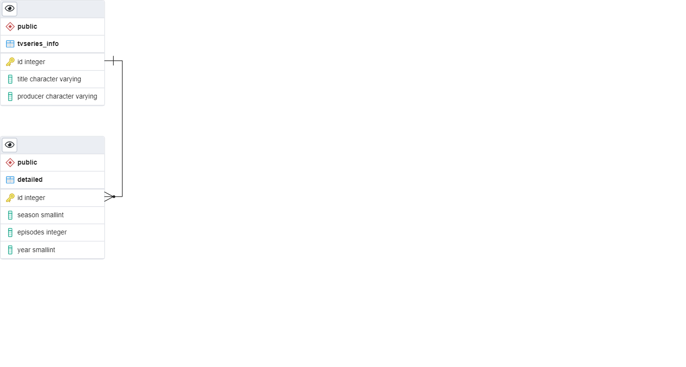

# Simple CRUD API Golang Postgres

CRUD API Golang with postgresql
ERD : 


## how-to
- download this repo
- prepare the database, just run the query in data.sql
- Change .env as your setting
- run the program
```
go run main.go
```
